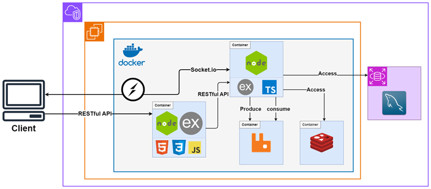

# LivePoll

LivePoll is a real-time polling platform designed to deliver efficient, reliable cross-device synchronization of voting results.

## Table of Contents
- [Introduction](#introduction)
- [Technical Highlights](#technical-highlights)
- [System Architecture](#system-architecture)
- [Demo](#demo)
- [License](#license)

## Introduction

Do you need a quick way to collect audience feedback during meetings, conferences, or live events? LivePoll provides a seamless solution. Designed for high-concurrency environments, it ensures real-time synchronization of polling results across multiple devices.

## Technical Highlights

### Tech Stack

-   **Languages and Frameworks**: Node.js, Express.js, TypeScript
-   **DBMS**: MySQL, Redis
-   **Message Queue and Real-Time Communication**: RabbitMQ, WebSocket (Socket.io)
-   **Frontend**: HTML, CSS, JavaScript
-   **Containerization and Cloud**: Docker, AWS (EC2, VPC, RDS)
-   **Testing**: Artillery (Load Testing), Postman (API Testing)

### **1. Distributed System Design**

-   Used  **Redis**  as a caching layer to handle high-concurrency requests during voting.
-   Ensuring front-end requests are reliably queued in **RabbitMQ** for asynchronous processing.

### **2. Real-Time Data Synchronization**

-   Implemented  **Socket.io**  to synchronize data across multiple clients in real-time.
-   Designed mechanisms for instant updates of voting statuses and results during live sessions.

### **3. Containerized Development and Deployment**

-   Utilized  **Docker**  to build multi-container architecture, streamlining both development and deployment workflows.

### **4. TypeScript for Maintainable Backend Code**

-   Implemented  **TypeScript**  in the backend to ensure type safety, enhance developer productivity, and improve codebase maintainability.

### **5. Stress Testing with Artillery**

-   Conducted load tests on  **Socket.io**  to evaluate and optimize performance under high-concurrency scenarios.

### **6. Frontend-Backend Separation and Modularization**

-   Modularized the frontend by separating API calls, WebSocket management, and DOM operations.
-   Adopted  **MVC Architecture**  for backend design to improve maintainability and scalability.

### **7. Enhanced User Experience**

-   Designed user-friendly interfaces, including a  **QR Code**  feature for quick access via mobile devices.
-   Enabled real-time voting progress bars and dynamic updates to improve interactivity.

### **8. Security**

-   Managed sensitive configurations using  **AWS Secrets Manager**  to enhance security.

## System Architecture

Below is the LivePoll system architecture, followed by a step-by-step explanation:  

### **1. Retrieving Poll Data (When Voting Is Not Active)**

1. A user sends an HTTP request to a specific route to retrieve poll data.
2. The backend queries the **MySQL database** for the requested data.
3. The retrieved data is sent back to the user as an HTTP response. 

---

### **2. Submitting Votes (During Active Polling)**

1. A user submits their vote via **Socket.io**, sending the message to the backend.
2. The backend forwards the vote message to a **RabbitMQ message queue** for processing.
3. The backend  retrieves the message from RabbitMQ and:
   - Updates the **Redis cache** with the latest vote counts for real-time tracking.
   - Sends an acknowledgment (Ack) to RabbitMQ, confirming successful processing.
4. The backend then broadcasts the updated vote results via **Socket.io** to all connected clients, ensuring real-time synchronization.

---

### **3. Finalizing Poll Results (When Voting Ends)**

1. The backend sends a **Socket.io** message to all connected clients to indicate the poll has ended, disabling voting interfaces.
2. The backend retrieves the temporary vote data from **Redis**.
3. The final results are written to the **MySQL database** for persistent storage.
4. Redis cache is cleared to remove the temporary vote data, ensuring fresh data for the next poll.

## Demo

## License

This project is released under the [MIT License](https://choosealicense.com/licenses/mit/), allowing unrestricted use, modification, and distribution for personal or commercial purposes.

